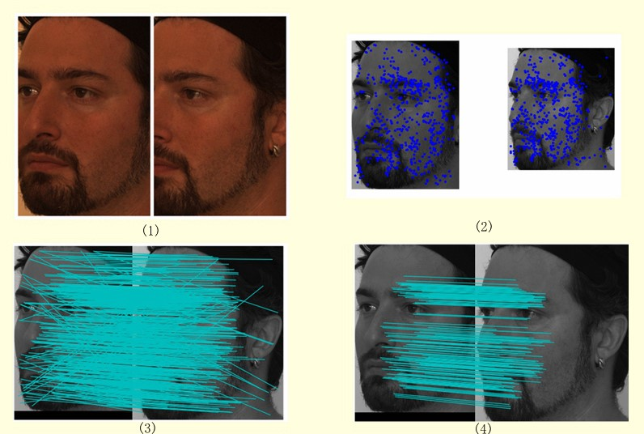
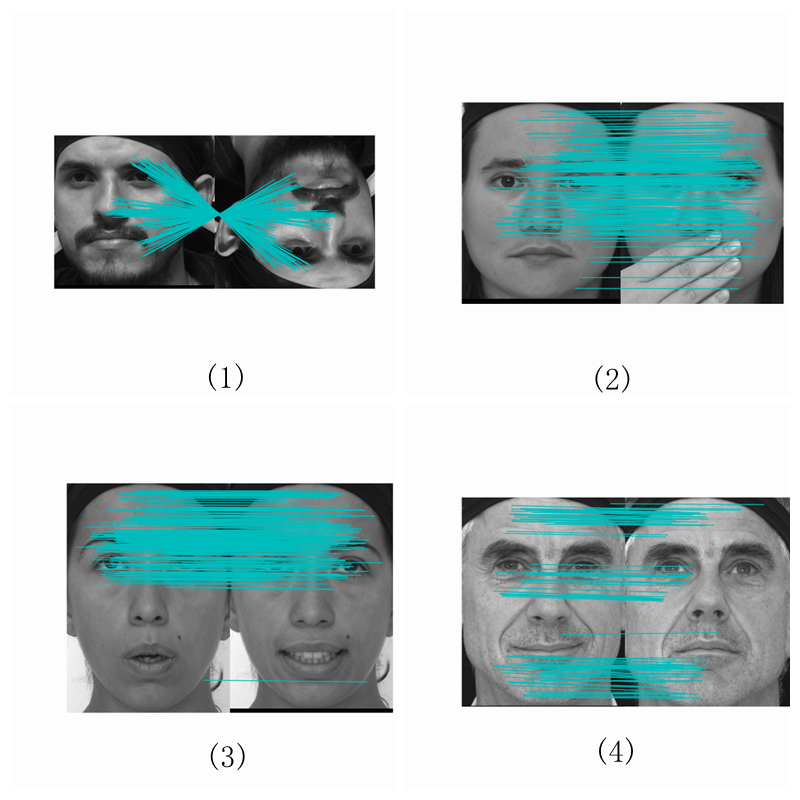

# Pore Scale invariant feature transform
PSIFT is a special SIFT methon to feature.Is is different from SIFT,it just detector the maximun value in gaussian pyramid.
You can get more information form (https://www.sciencedirect.com/science/article/pii/S003132031400394X)

And i`am not the auther of that paper.I just implement his methon using pyhton.By the way,this methon i written may not achiveve his desired effect.
# How to use it?
There are one example test_PSIFT.py.At first ,you need twe picture which is used to be detectored in the methon.
```python
        im1 = np.asarray(Image.open(file+'im1.png').convert('L'))
        im2 = np.asarray(Image.open(file+'im2.png').convert('L'))
```
im1 and im2 are images you gived.

If you want to get PSIFT feature,just read this 4 step:
* declar class 'Psift' :psift = Psift(im,octave_num=2,sigma1=1.1,upSampling=False)

* Create gaussian pyramid:psift.CreatePyramid()
* get scole poin:point_list = psift.ScolePoint(rmedge=False,curvature=10,specofic_hd=0)

* get feature by using scole point:  feature, new_point = psift.GetFeature(point_list)

# Application
You can match two feature picture with PSIFT:



More:https://ieeexplore.ieee.org/abstract/document/7059198/